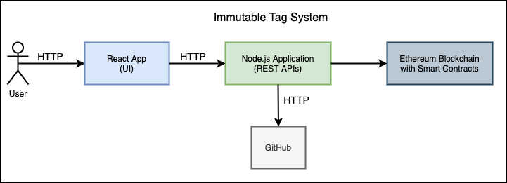

# Immutable Tag

## Application Components

Our application is made up of three fundamental components:

1. Ethereum Blockchain and smart contracts
1. A Node.js Middleware
1. Front-end Web Application using the React framework

The following figure shows how these components are connected:



## Running the application locally

### 1. Smart Contracts

#### 1.1 Cloning the repository

```bash
git clone https://github.com/Immutable-Tag/SmartContracts
```

#### 1.2 Installing dependencies

##### 1.2.1 Node.js

Download the latest LTS version of Node.js from [here](https://nodejs.org/en/download/). The current latest LTS Version is 16.13.0 and it includes npm 8.1.0.

##### 1.2.2 Truffle

```bash
npm install truffle --global
```

To make sure that truffle is installed correctly, run the following command:

```bash
truffle version
```

This is the output I see:

```bash
Truffle v5.4.18 (core: 5.4.18)
Solidity v0.5.16 (solc-js)
Node v16.13.0
Web3.js v1.5.3
```

##### 1.2.3 Ganache CLI

```bash
npm install ganache-cli@latest --global
```

#### 1.3 Simulating Ethereum network

##### 1.3.1 Running Ganache CLI to simulate Ethereum

```bash
ganache-cli --verbose --host 127.0.0.1 --port 8545 --accounts 10 --defaultBalanceEther 100 --gasLimit 6721975
```

##### 1.3.2 Deploy Smart Contract to the blockchain

In a separate terminal window, from the SmartContracts folder, run:

```bash
truffle migrate
```

##### 1.3.3 Getting the deployed Smart Contract address

The Smart Contract's address is needed by the Middleware in order to invoke methods in the Smart Contract.

Once the `truffle migrate` command has completed execution, the output will contain the following lines towards the end:

```bash
...
2_tag_contracts.js
==================

   Replacing 'ImmutableTag'
   ------------------------
   > transaction hash:    0x0e1ef624894d2a75d2356deac0daf3a077195eff60d1e96452662ce0804c3c5e
   > Blocks: 0            Seconds: 0
   > contract address:    0x5A58B7cAf4609a1c9f7934A0bDBcbeF3B4d27bb8
   > block number:        3
   > block timestamp:     1637725439
   > account:             0x851F4BE5447fbC3e40b50A650584551434D9579F
   > balance:             9999.97973206
   > gas used:            779116 (0xbe36c)
   > gas price:           20 gwei
   > value sent:          0 ETH
   > total cost:          0.01558232 ETH


   > Saving migration to chain.
   > Saving artifacts
   -------------------------------------
   > Total cost:          0.01558232 ETH


Summary
=======
> Total deployments:   2
> Final cost:          0.01942118 ETH
```

Copy the value of `contract address` (for example, in this case it is `0x5A58B7cAf4609a1c9f7934A0bDBcbeF3B4d27bb8` but it will change every time you run `truffle migrate`). Store this copied contract address in some location for now. In the next few steps we'll use this address.

### 2. Middleware

#### 2.1 Cloning the repository

```bash
git clone https://github.com/Immutable-Tag/Middleware.git
```

#### 2.2 Installing dependencies

```bash
npm install
```

#### 2.3 Linking the Middleware to the Smart Contract

Paste the previously copied contract address in the Middleware repo's `smartContractConfig/config.js` file on line 3 as the value for `contractAddress`.

#### 2.4 Add GitHub token

To create tags in GitHub we need to use a Personal Access Token (PAT) with write permissions.

To create a PAT, go to <https://github.com/settings/tokens> and click the `Generate new token` button. Select all the permissions and click `Generate Token`. Copy the token and paste it in `smartContractConfig/config.js` on the last line as the value for `githubToken`.

#### 2.5 Running the server

```bash
npm start
```

### 3. ReactApp

#### 3.1 Cloning the repository

```bash
git clone https://github.com/Immutable-Tag/ReactApp.git
```

#### 3.2 Installing dependencies

```bash
npm install
```

#### 3.3 Running the application

```bash
npm start
```
